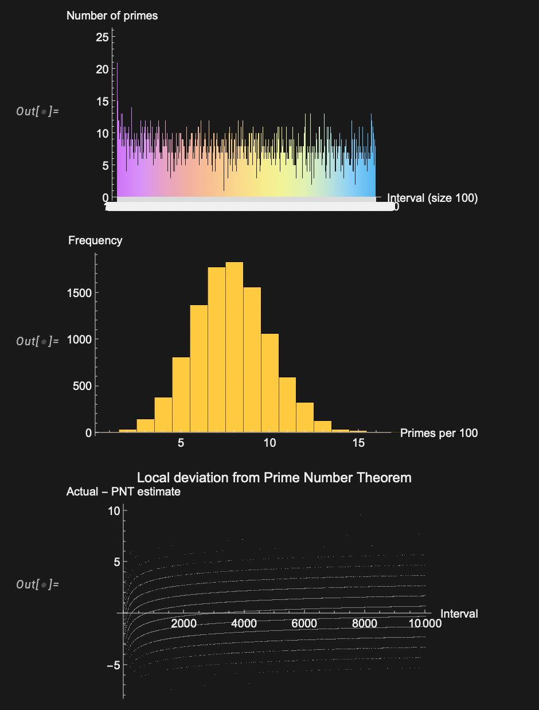

# Computational Mathematics Projects

### 1. Prime Distribution
Visualizes prime counts across intervals of size 100 up to 10⁶, their frequency distribution, and local deviation from the Prime Number Theorem estimate of 100/ln(n).

**Stack:** Wolfram Mathematica

